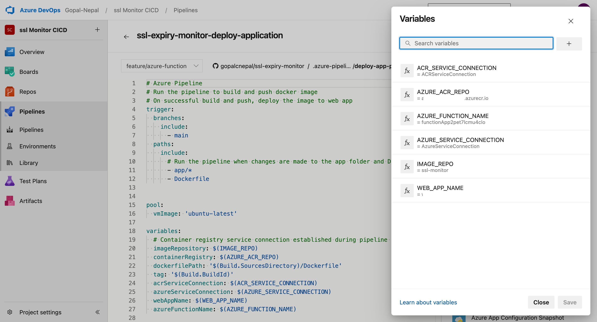

<!-- PROJECT SHIELDS -->
<!--
*** I'm using markdown "reference style" links for readability.
*** Reference links are enclosed in brackets [ ] instead of parentheses ( ).
*** See the bottom of this document for the declaration of the reference variables
*** for contributors-url, forks-url, etc. This is an optional, concise syntax you may use.
*** https://www.markdownguide.org/basic-syntax/#reference-style-links
-->
[![Contributors][contributors-shield]][contributors-url]
[![Forks][forks-shield]][forks-url]
[![Stargazers][stars-shield]][stars-url]
[![Issues][issues-shield]][issues-url]
[![project_license][license-shield]][license-url]
[![LinkedIn][linkedin-shield]][linkedin-url]

<div align="center">
  <h3 align="center">SSL Certificate Expiry Monitor</h3>

  <p align="center">
    A web application to track and monitor SSL certificate expiration dates for multiple domains
    <br />
    <br />
    ·
    <a href="https://github.com/gopalcnepal/ssl-expiry-monitor/issues">Report Bug</a>
    ·
    <a href="https://github.com/gopalcnepal/ssl-expiry-monitor/issues">Request Feature</a>
  </p>
</div>

## About The Project


SSL Certificate Expiry Monitor is a Flask-based web application that helps you keep track of SSL certificates for multiple domains. It provides a simple dashboard to monitor expiration dates and sends alerts when certificates are approaching expiration.

Key features:
* Add and manage multiple domains
* Automatic SSL certificate expiry date checking
* Visual alerts for certificates expiring soon
* Add notes for each domain
* Easy-to-use dashboard interface

### System Architecture and Overall Flow


### Built With

* ![Flask][Flask]
* ![Bootstrap][Bootstrap]
* ![SQLAlchemy][SQLAlchemy]
* ![SQLite][SQLite]
* ![Docker][Docker]

## Getting Started

To get a local copy up and running, follow these steps.

### Prerequisites

* Python 3.8 or higher
* pip (Python package manager)
* Docker (for containerization)

### Installation

1. Clone the repository
   ```sh
   git clone https://github.com/gopalcnepal/ssl-expiry-monitor.git
   ```
2. Create and activate a virtual environment
   ```sh
   python -m venv venv
   source venv/bin/activate  # On Windows: venv\Scripts\activate
   ```
3. Install required packages
   ```sh
   pip install -r requirements.txt
   ```
4. Run the application
   ```sh
   python -m flask run
   ```

### Running with Docker

1. Build the Docker image
   ```sh
   docker build -t ssl-expiry-monitor .
   ```
2. Run the Docker container
   ```sh
   docker run -p 5000:5000 ssl-expiry-monitor
   ```
3. Access the application at `http://localhost:5000`

## Usage

1. Access the application at `http://localhost:5000`
2. Add domains using the form on the left side
3. View certificate information in the main table
4. Use the refresh button to update certificate information
5. Edit or delete entries as needed


### Azure Deployment Configurations
To deploy this project to Azure you will need to perform **ONE time** setup of Azure resources and Azure DevOps.

#### Prerequisites
* Azure subscription
* User with required permissions

#### Setting up Azure Group and Managed Identity

1. Azure Group Creation:
   * Login to Azure Portal
   * Search for "Resource Group"
   * Click "Create"
   * Enter details and Create the Resource Group
   

2. Managed Identity Creation:
   * Login to Azure Portal
   * Search for "Managed Identites"
   * Click "Create"
   * Enter details as required (Note: Select resource group created in previous step)
   

3. Assign Role to Managed Identity:
   * Login to Azure Portal
   * Go to Managed Identity created in previous step
   * Select "Azure Role Assignment"
   * Click "Add role assignment "
   * Provide "Owner" role to Resource Group created earlier.
   


### Azure DevOps Configurations
This section provides information on Azure DevOps setup. This is **ONE Time** setup. You need to change if there is change in infrastructure resource provisioning or permissions.

#### Prerequisites
* Azure subscription
* Azure DevOps organization and project
* User with required permissions

#### A. Azure DevOps Pipeline Setup

The project contains two pipelines:
* Infrastructure Pipeline (`infra-pipeline.yml`) - Deploys Azure resources
* Application Pipeline (`deploy-app-pipeline.yml`) - Builds and deploys the application

1. **Infrastructure Pipeline**:
   * Create new pipeline in Azure DevOps
   * Select "Azure Repos Git" as source
   * Select repository
   * Choose "Existing Azure Pipelines YAML file"
   * Path: `.azure-pipelines/infra-pipeline.yml`
   * Configure variables:
     ```yaml
     RESOURCE_GROUP_NAME
     ```
     

2. **Application Pipeline**:
   * Create another pipeline
   * Select "Azure Repos Git" as source
   * Select repository
   * Choose "Existing Azure Pipelines YAML file"
   * Path: `.azure-pipelines/deploy-app-pipeline.yml`
   * Configure variables:
     ```yaml
     IMAGE_REPO
     AZURE_ACR_REPO
     WEB_APP_NAME
     ```
     

#### B. Setting up Service Connections

1. Create an Azure Service Connection:
   * Go to Project Settings > Service Connections
   * Click "New Service Connection"
   * Select "Azure Resource Manager"
   * Choose "Managed Identity"
   * Select your subscription, resource group and Managed Identity created previously.
   * Name it "AzureServiceConnection". **(Important: If you named it differently, change it in pipeline too)**
   * Check "Grant access permission to all pipelines"
   * Click "Save"


**IMPORTANT!**

This step 2 needs to be done ONLY after the resources has been deployed by first pipeline (infra-pipeline.yml). This is because it connects Azure DevOps to provide special permission to Azure Container Registry.

2. Create an Azure Container Registry Service Connection:
   * Go to Project Settings > Service Connections
   * Click "New Service Connection"
   * Select "Docker Registry"
   * Choose "Azure Container Registry"
   * Select your subscription and registry
   * Name it "AzureContainerRegistryServiceConnection"**(Important: If you named it differently, change it in pipeline too)**
   * Check "Grant access permission to all pipelines"
   * Click "Save"
   


The dashboard will show visual alerts:
* 🟡 Yellow warning for certificates expiring within 30 days
* 🔴 Red warning for certificates expiring within 7 days

## Contributing

Contributions are welcome! Here's how you can help:

1. Fork the Project
2. Create your Feature Branch (`git checkout -b feature/AmazingFeature`)
3. Commit your Changes (`git commit -m 'Add some AmazingFeature'`)
4. Push to the Branch (`git push origin feature/AmazingFeature`)
5. Open a Pull Request

## License

Distributed under the MIT License. See `LICENSE` for more information.

## Contact

Project Link: [https://github.com/gopalcnepal/ssl-expiry-monitor](https://github.com/gopalcnepal/ssl-expiry-monitor)

<!-- MARKDOWN LINKS & IMAGES -->
[contributors-shield]: https://img.shields.io/github/contributors/gopalcnepal/ssl-expiry-monitor.svg?style=for-the-badge
[contributors-url]: https://github.com/gopalcnepal/ssl-expiry-monitor/graphs/contributors
[forks-shield]: https://img.shields.io/github/forks/gopalcnepal/ssl-expiry-monitor.svg?style=for-the-badge
[forks-url]: https://github.com/gopalcnepal/ssl-expiry-monitor/network/members
[stars-shield]: https://img.shields.io/github/stars/gopalcnepal/ssl-expiry-monitor.svg?style=for-the-badge
[stars-url]: https://github.com/gopalcnepal/ssl-expiry-monitor/stargazers
[issues-shield]: https://img.shields.io/github/issues/gopalcnepal/ssl-expiry-monitor.svg?style=for-the-badge
[issues-url]: https://github.com/gopalcnepal/ssl-expiry-monitor/issues
[license-shield]: https://img.shields.io/github/license/gopalcnepal/ssl-expiry-monitor.svg?style=for-the-badge
[license-url]: https://github.com/gopalcnepal/ssl-expiry-monitor/blob/master/LICENSE.txt
[linkedin-shield]: https://img.shields.io/badge/-LinkedIn-black.svg?style=for-the-badge&logo=linkedin&colorB=555
[linkedin-url]: https://linkedin.com/in/gopalcnepal
[Flask]: https://img.shields.io/badge/Flask-000000?style=for-the-badge&logo=flask&logoColor=white
[Bootstrap]: https://img.shields.io/badge/Bootstrap-563D7C?style=for-the-badge&logo=bootstrap&logoColor=white
[SQLAlchemy]: https://img.shields.io/badge/SQLAlchemy-FF0000?style=for-the-badge&logo=python&logoColor=white
[SQLite]: https://img.shields.io/badge/SQLite-07405E?style=for-the-badge&logo=sqlite&logoColor=white
[Docker]: https://img.shields.io/badge/Docker-0000FF?style=for-the-badge&logo=sqlite&logoColor=white
